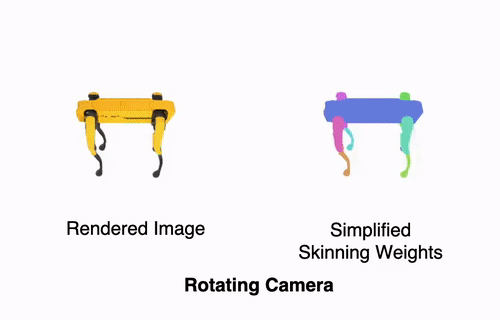
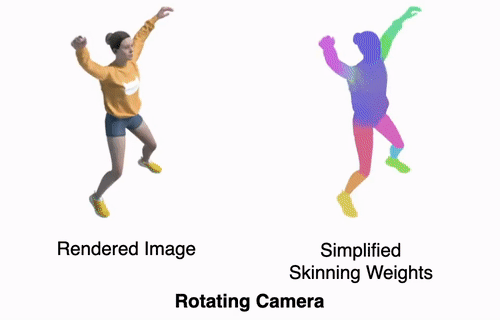

# Template-free Articulated Neural Point Clouds for Reposable View Synthesis

### NeurIPS 2023

#### [🌐 Project Website](https://lukas.uzolas.com/Articulated-Point-NeRF/) | [📝 Paper](https://arxiv.org/abs/2305.19065) 

<p float="left"align="middle">
  
   
</p>
*Reposable 3D reconstruction based on images and masks only, without making use of any priors in form of object-specific skeletons or templates.*

#### Abstract:

Dynamic Neural Radiance Fields (NeRFs) achieve remarkable visual quality when synthesizing novel views of time-evolving 3D scenes. However, the common reliance on backward deformation fields makes reanimation of the captured object poses challenging. Moreover, the state of the art dynamic models are often limited by low visual fidelity, long reconstruction time or specificity to narrow application domains. In this paper, we present a novel method utilizing a point-based representation and Linear Blend Skinning (LBS) to jointly learn a Dyynamic NeRF and an associated skeletal model from even sparse multi-view video. Our forward-warping approach achieves state-of-the-art visual fidelity when synthesizing novel views and poses while significantly reducing the necessary learning time when compared to existing work. We demonstrate the versatility of our representation on a variety of articulated objects from common datasets and obtain reposable 3D reconstructions without the need of object-specific skeletal templates. 

**[Lukas Uzolas](https://lukas.uzolas.com/), 
[Elmar Eisemann](https://graphics.tudelft.nl/~eisemann/),
[Petr Kellnhofer](https://kellnhofer.xyz/)**
<br>
[Delft University of Technology](https://graphics.tudelft.nl/)
<br>

## Run

### Environment

Please first install **Pytorch** and **torch_scatter** manually, as they are machine dependent. We used python version 3.9.12. CUDA has to be installed on your machine for the custom cuda kernels to work, see [TiNeuVox](https://github.com/hustvl/TiNeuVox) and [DirectVoxGO](https://github.com/sunset1995/directvoxgo). Then:
```
pip install -r requirements.txt
```
**Dependencies**:

  - `PyTorch`
  - `numpy` 
  - `torch_scatter`
  - `scipy`
  - `lpips`
  - `tqdm`
  - `mmcv`
  - `opencv-python`
  - `imageio`
  - `imageio-ffmpeg`
  - `Ninja`
  - `einops`
  - `torch_efficient_distloss`
  - `pykeops`
  - `tensorboardX`
  - `seaborn`
  - `scikit-image`
  - `torchvision`
  - `scipy`
  - `connected-components-3d`
  - `pandas`
  - `roma`


If any unexpected problems should arise while setting up the repository, you can further consult [TiNeuVox](https://github.com/hustvl/TiNeuVox) and [DirectVoxGO](https://github.com/sunset1995/directvoxgo), as the backbone code is based on their repository.

### Data

Download the datasets ([dnerf](https://github.com/albertpumarola/D-NeRF), [wim](https://github.com/NVlabs/watch-it-move), [zju](https://github.com/zju3dv/neuralbody/blob/master/INSTALL.md#zju-mocap-dataset)) and arrange as follows.

```
├── data 
│   ├── dnerf
│   │	├── jumpingjacks
│   │	├── ...
│   ├── wim
│   │	├── ...
│   ├── zju
│   │	├── ...
```

Note that you have to follow the pre-processing step as defined in [wim](https://github.com/NVlabs/watch-it-move) for the ZJU data to obtain the pickle files.

### Train and Render

**Train backbone & PCD representation:**
```python run.py --config configs/nerf/jumpingjacks.py --i_print 1000 --render_video --render_pcd```

You will be able to find the point cloud and skeleton .pcd files saved in the corresponding _pcd_ folder of the experiment.

**Render backbone (TiNeuVox):**
```python run.py --config configs/nerf/jumpingjacks.py --i_print 1000 --render_video --render_only```

**Render PCD representation:**
```python run.py --config configs/nerf/jumpingjacks.py --i_print 1000 --render_video --render_only --render_pcd```

**Visualise canonical:**
```python run.py --config configs/nerf/jumpingjacks.py --i_print 1000 --visualise_canonical --render_pcd --render_only```

**Prune bones, merge weights and visualise canonical:**
```python run.py --config configs/nerf/jumpingjacks.py --i_print 1000 --visualise_canonical --render_pcd --render_only --degree_threshold 30```

**Repose trained kinematic point cloud:**
```python run.py --config configs/nerf/jumpingjacks.py --i_print 1000 --repose_pcd --render_only --render_pcd --degree_threshold 30``` 

This will generate a reposed video sequence with random bone rotations. Check the code to see how to manually set the bone rotations.


## Known Errors
- Some unused and missing requirements
- Attribute error in TemporalPoints
- WIM dataloader intrininsics shape


## ToDos:
- [ ] Fix known errors (Will do in the next couple of days, 21.12.23)
- [ ] Add stand-alone instructions for initial kinematic model extraction based on point cloud 


## Acknowledgements

This repository is partially based on [TiNeuVox](https://github.com/hustvl/TiNeuVox), [DirectVoxGO](https://github.com/sunset1995/directvoxgo), [D-NeRF](https://github.com/albertpumarola/D-NeRF). Thanks for their works.


## Citation

```
@inproceedings{
  uzolas2023templatefree,
  title={Template-free Articulated Neural Point Clouds for Reposable View Synthesis},
  author={Lukas Uzolas and Elmar Eisemann and Petr Kellnhofer},
  booktitle={Thirty-seventh Conference on Neural Information Processing Systems},
  year={2023},
  url={https://openreview.net/forum?id=fyfmHi8ay3}
}
```
